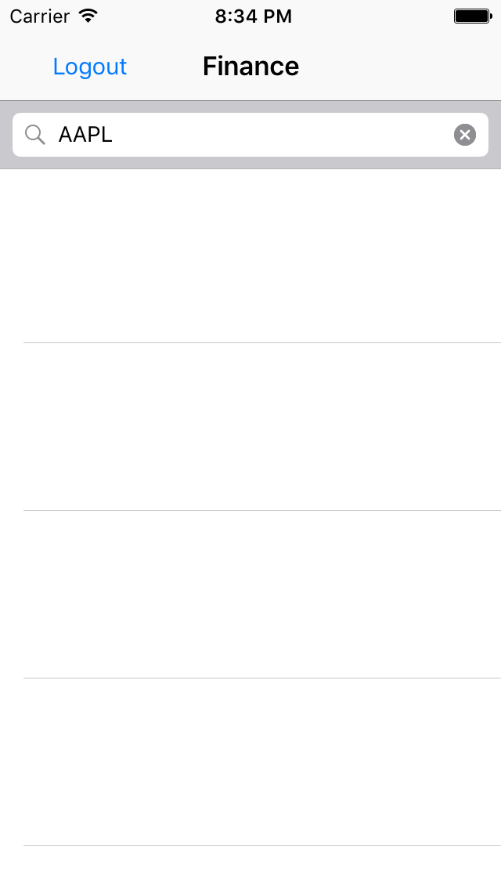
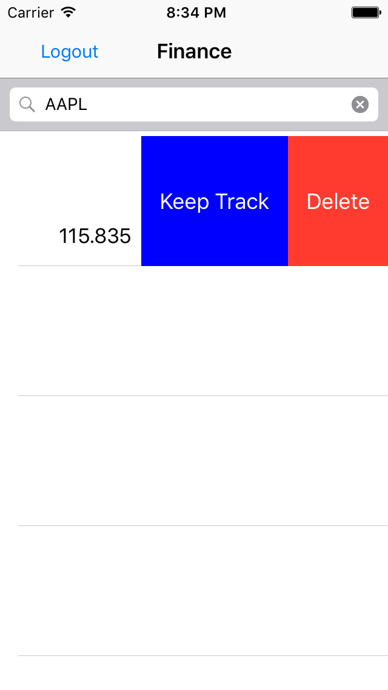
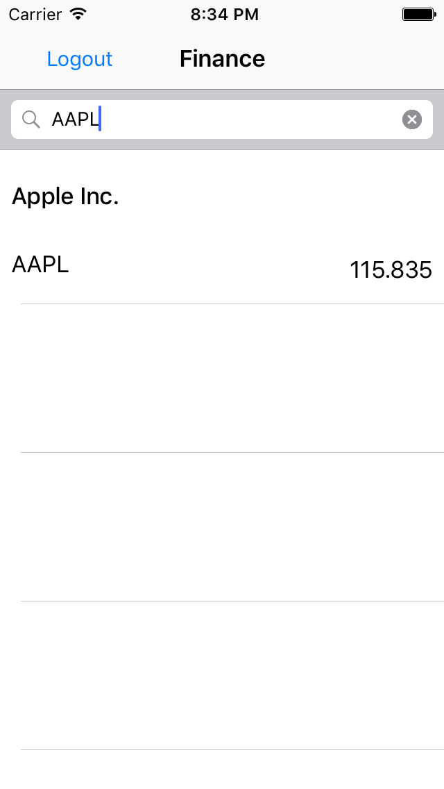

Joël Fleuren

als de app gestart word moet er ingelogd worden met behulp van de firebase authenticatie.
eenmaal ingelogd is het mogelijk voor de gebruiker om op een aandelen symbool te zoeken naar het aandeel en de gewenste informatie over het aandeel te krijgen zoals de naam van het bedrijf en de price per aandeel.
het is tevens ook mogelijk dit aandeel veder te volgen zodat elke keer als je ingelogd ben je informatie over dit aandeel krijgt.
de opslag van de aandelen worden ook gedaan met firebase.
de data komt van een yahoo finance api die in CSVDemo van een csv bestand wordt omgezed naar strings

The screenshots

